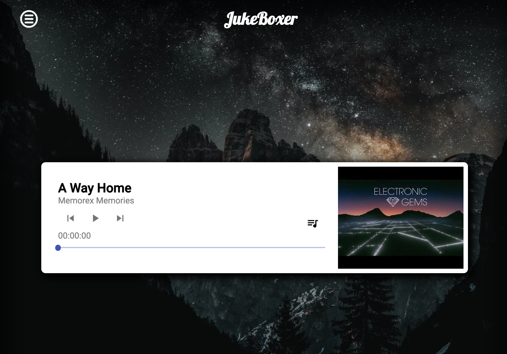
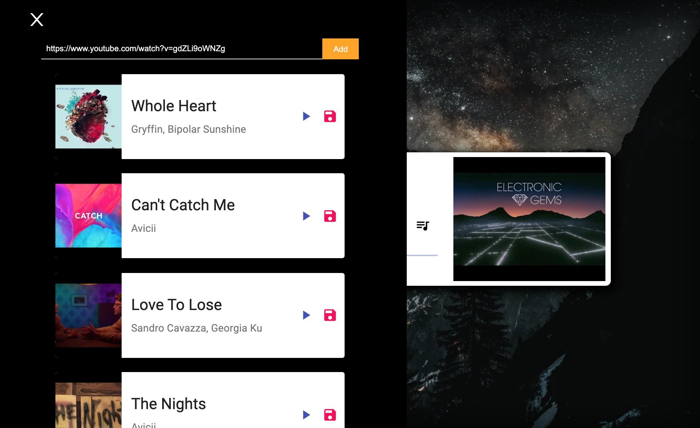

# Juke Boxer
"Juek Boxer is a web based music player app created with React, GraphQL, Hasura, MaterialUI & Styled-components and Context-API.



## Table of Contents
1. [General info](#general-info)
2. [Technologies](#technologies)
3. [Setup](#setup)
4. [Features](#features)
5. [Inspiration](#inspiration)
6. [Contact](#contact)


## General info

This is a part of my web development portfolio projects.
This is a full stack project that implements React, GraphQl, Hasura, Material UI & Styled-compoents and Context API. This music player app allows users to store thier music from Youtube/Soundcloud and to make a music list.

## Technologies
The specific technologies implements in this projects are:
* apollo-boost: 0.4.9
* apollo-client: 2.6.10
* graphql: 15.5.0
* react: 17.0.2

## Setup
To run this project, intall it locally using the pakage managers yarn/npm.

```
cd music-player-app-v2
yarn
yarn start

```

## Features
* Retrive music url from Youtube/Sound Cloud, and create your own music list!

## Screenshots




## Contact
Email: kimdooinn1@gmail.com /
[Linkedin](https://www.linkedin.com/in/dooinnkim/)


